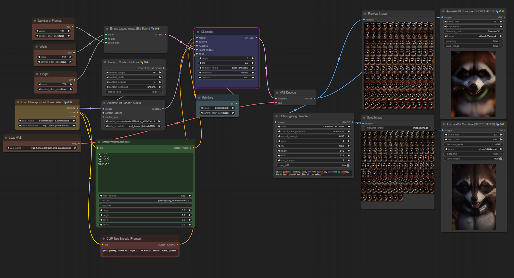

# LCM X ANIMATEDIFF

## Overview

LCM X ANIMATEDIFF is a workflow designed for ComfyUI that enables you to test the LCM node with AnimateDiff. This workflow showcases the speed and capabilities of LCM when combined with AnimateDiff.

## Getting Started

To use this workflow, you'll need to have ComfyUI and AnimateDiff installed. Make sure you have the following prerequisites:

- ComfyUI: [https://github.com/0xbitches/ComfyUI-LCM](https://github.com/0xbitches/ComfyUI-LCM)
- AnimateDiff: [https://github.com/Kosinkadink/ComfyUI-AnimateDiff-Evolved](https://github.com/Kosinkadink/ComfyUI-AnimateDiff-Evolved)

## Usage

1. Clone this repository to your local machine.
2. Configure ComfyUI and AnimateDiff as per their respective documentation.
3. Open the provided `LCM_AnimateDiff.json` file and customize it to your requirements.
4. Run the workflow, and observe the speed and results of LCM combined with AnimateDiff.

## License

This project is licensed under the [MIT License](LICENSE).
